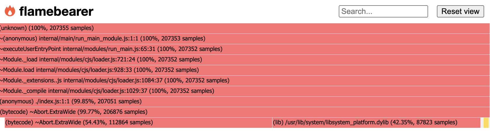

# `node --prof` を知った

- 計測

```
$ node --prof index.js
```

- 集計

```
$ node node --prof-process isolate-*.log
```

```
$ node node --prof-process --preprocess -j isolate-*.log | flamebearer
```

`-j` は json 出力
`-j` を取ると，人が読めるよなサマリとして出力される
`flamebearer` は，profile 結果の json を可視化してくれる npm
`--preprocess` は [https://nodejs.org/api/cli.html](https://nodejs.org/api/cli.html) に乗ってないけど，
多分 V8 log の書式にするとかだと思う



こんなかんじ
